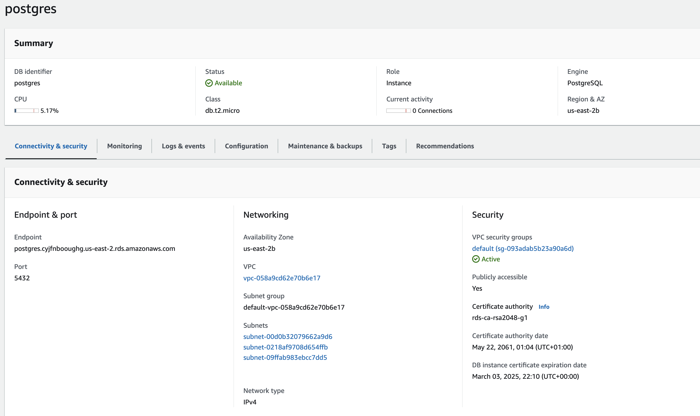
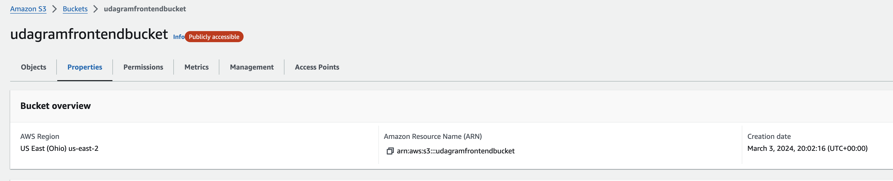
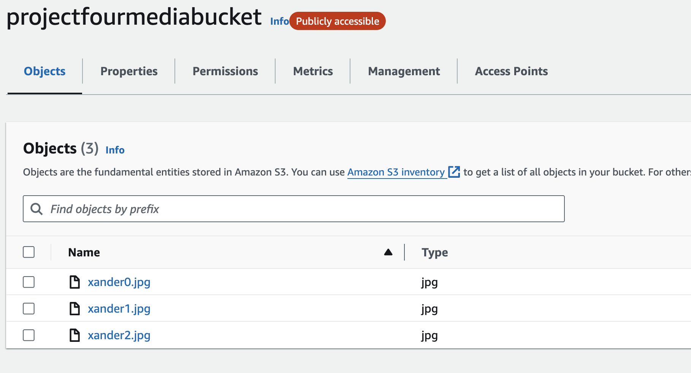
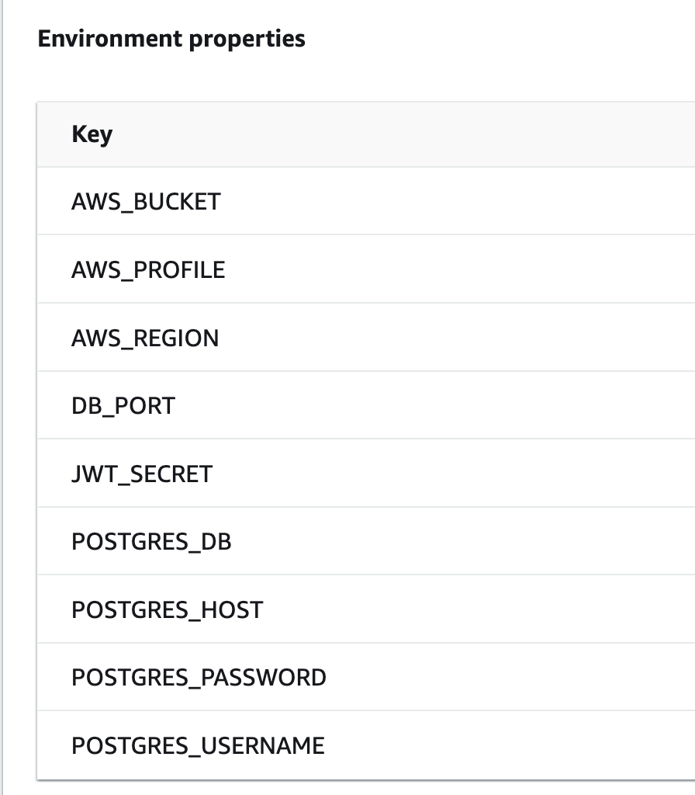
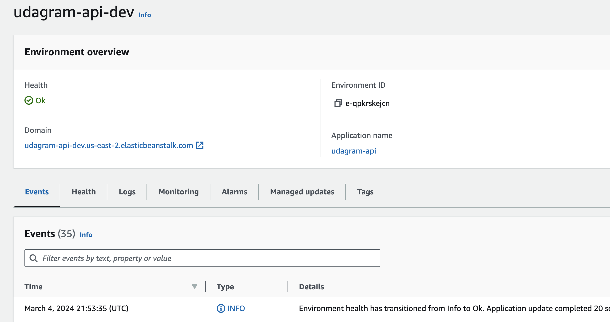

# Infrastructure Documentation
This document covers the different infrastructure/services that was created to host the full stack app.

## RDS 
The choice of DB for this project was RDS as the simplest and most effective database service in AWS.

For engine, the choice was `postgres` with version `12.16-R2`.

As the DB has not been configured for `snapshots` or `backups`, if it needs recreating using the following steps:

* Go to AWS, RDS and click `Create Database` and ensure `Standard create` is selected.
* Choose `PostgreSQL` for the engine with version `12.16-R2`.
* For tier, select the `Free tier` option.
* For availability and durability, choose `Single DB instance`.
* Set `DB cluster identifier` to a name of your choosing (postgres was used for this project).
* Leave username `postgress` and set a password of your choosing (postgres was used for this project).
* Choose the option `Burstable classes` for `DB instance class` and select `db.t2.micro`.
* Keep storage settings as default.
* For `Connectivity`, keep `Compute resource` as `Don't connect` and select default VPC.
* Leave `DB subnet group` as default option.
* Choose `Yes` for `Public Access`
* Keep `VPC security group` settings as default and choose `No preference` for Availability Zone.
* Keep `Database authentication` as default `password authentication`
* For `Monitoring` disable `performance insights` and `enhanced monitoring`.
* Expand `Additional configuration` and set `Initial database name` to match `cluster identifier`.
* Still in `Additional configuration` disable `Backup`

Once you have configured the above settings, click `Create database`.



## S3
Two S3 Buckets have created in this project. 

1. udagramfrontendbucket -- hosts udagram-frontend app
2. projectfourmediabucket -- media bucket for udagram-api on EB

### udagramfrontendbucket
The first bucket statically hosts the udagram-frontend app and is publicly accessible.

This bucket was manually created and populated by the CircleCI pipeline.

To configure a new bucket to match this, follow the below steps:

* Go to AWS, Amazon S3, Buckets and click `Create Bucket`.
* Set AWS region to default (us-east-2 was used for this project).
* Set `Bucket name` to globally unqiue name of your choosing.
* Keep `Object Ownership` as default `ACLs disabled`.
* For `Block Public Access` un-check `Block all public access` as this bucket must be publicly accessible.
* Keep `Bucket Versioning` as default `Disabled`.
* (OPTIONAL) Add any tags to label bucket.
* For `encryption` keep settings as default.

Once you have configured the above settings, click `Create bucket`.

#### Bucket Policy and CORS
Next, this bucket needs the `Bucket policy` and `CORS` policy defining.

* Back on S3 Bucket overview page, click onto the newly created bucket.
* Go to `Permissions` tab.
* Find `Bucket policy` and click `edit`.
* Add the following snippet of code and save changes (changing ARN to match bucket name):

```
{
    "Version": "2012-10-17",
    "Id": "Policy1709496504864",
    "Statement": [
        {
            "Sid": "Stmt1709496499107",
            "Effect": "Allow",
            "Principal": "*",
            "Action": "s3:*",
            "Resource": "arn:aws:s3:::unique-bucket-name"
        }
    ]
}
```

* Back on `Permissions` tab, scroll down to `Cross-origin resource sharing (CORS)`.
* Edit CORS policy and add the following snippet of code and save changes:

```
[
    {
        "AllowedHeaders": [
            "*",
            "Content-Type",
            "Authorization",
            "Access-Control-Allow-Origin",
            "Access-Control-Allow-Headers",
            "Access-Control-Allow-Methods"
        ],
        "AllowedMethods": [
            "POST",
            "GET",
            "PUT",
            "DELETE",
            "HEAD"
        ],
        "AllowedOrigins": [
            "*"
        ],
        "ExposeHeaders": []
    }
]
```

* Go to `Properties` tab and scroll to the bottom to find `Static website hosting`.
* Click edit and select `Enable`.
* Keep `Hosting type` as default `Host a static website.
* Set `Index document` to `index.html`
* Save changes.
* Go to `Objects` tab and click `Upload`.
* Find `udagram-frontend/www` (compiled folder) locally and drag and drop into upload.
* Click `Upload` and once all files are uploaded, click `Close` top-right.
* On the `Objects` view, find a select the `index.html` file and click `Open`.
* This will open the the homepage of the app and show the bucket URL to access it at.



### projectfourmediabucket
The media bucket for this project was created using the same steps as the frontend bucket.

However, as this bucket isn't hosting an app, it should be left as an empty bucket after creation.

This bucket should have the Bucket Policy and CORS configured as above.



## Elastic Beanstalk (EB)
The EB environment was created manually using the EB CLI with the following steps:

* Navigate to the project/repository folder in a terminal.
* Inside the `udagram-api` folder, run `eb init`.
* Browse to the `udagram-api` folder and modify the `config.yml` file under `.elasticbeanstalk`.
* Ensure the `default_platform` to `Node.js 14` and `default_region` is set to the same region as the S3 bucket.
* Once the configuration is complete, create the EB environment by running the following command: `eb create --single --keyname mykeypair --instance-types t2.micro`.
* Go to AWS console, Elastic Beanstalk and click on your environment.
* On the left-hand menu, go to `Configuration` under `Environment`.
* Find `Updates, monitoring, and logging` and click `Edit`.
* Scroll down to `Environment properties` and configure the environment variables. (see screenshot for reference).



The EB app will take several minutes to start-up and will show as status `Degraded`. Once it has finished loading and is running, it will show as `OK`.



