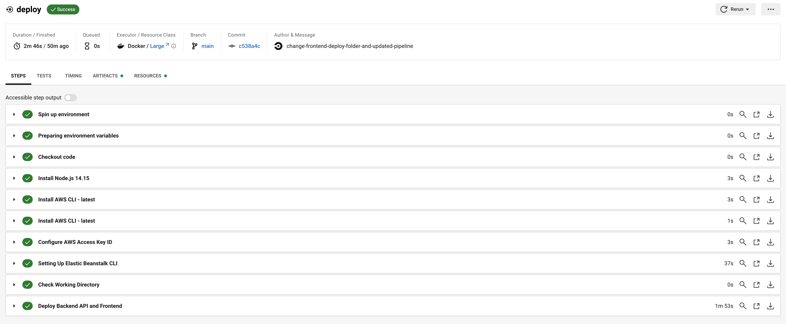

# Pipeline Documentation

## Circle CI
The pipeline tool used for this project is CircleCI.

The purpose of the pipeline is to automate building and deploying of the node.js apps.

Here is an overview of the pipelines steps:


## Pipeline Breakdown
The pipeline of several steps to build the applications and deploy them to AWS.

The full breakdown of steps is:

### Build workflow
1. Pipeline worker && Environment variables. These are handled by CircleCI and get configured when the pipeline executes.
2. Checkout self: checkout repository to working directory of CircleCI worker.
3. Install node.js 14.15: install node 14.15.0 as key dependency version for apps to build.
4. Install AWS CLI: installs AWS CLI using CircleCI Orb.
5. Setup AWS CLI: configure AWS CLI using ENV Vars `AWS_ACCESS_KEY_ID` and `AWS_SECRET_ACCESS_KEY`.
6. Setup Elastic Beanstalk CLI: configures the EB CLI to later deploy app.
7. Install Frontend Dependencies: installs dependencies defined in `package.json` for udagram-frontend.
8. Install API Dependencies: installs dependencies defined in `package.json` for udagram-api.
9. Frontend Lint: lints frontend app for any formatting errors or bad code.
10. Frontend Build: builds frontend app to check it compiles without error.
11. API Build: builds backend-api app to check it compiles without error.

### Deploy workflow
1. Pipeline worker && Environment variables. These are handled by CircleCI and get configured when the pipeline executes.
2. Checkout self: checkout repository to working directory of CircleCI worker.
3. Install node.js 14.15: install node 14.15.0 as key dependency version for apps to build.
4. Install AWS CLI: installs AWS CLI using CircleCI Orb.
5. Setup AWS CLI: configure AWS CLI using ENV Vars `AWS_ACCESS_KEY_ID` and `AWS_SECRET_ACCESS_KEY`.
6. Setup Elastic Beanstalk CLI: configures the EB CLI to later deploy app.
7. Check Working Directory: runs `ls -R` to see all files and folders in current directory and be able to check in event a file i.e. `beanstalk.yml` was missing.
8. Deploy Backend API & Frontend: deploys udagram-api to elastic beantstalk environment. Also deploys udagram-frontend to S3 bucket.

Here is a screenshot of the last succesful run for both stages:




## Workflow Filters
The pipeline has a trigger to auto-run when a commit is made to `main` branch of the repository.

The `deploy` workflow has a dependency on the `build` workflow completed. This means if the build fails, the pipeline will never try to deploy.

These filters are configured as follows:

```
workflows:
  udagram:
    jobs:
      - build:
          filters:
            branches:
              only:
                - main
      - deploy:
          requires:
            - build
```

If any adjustment is desired i.e. auto-run on develop. This can be added to the above config and updated in `.circleci/config.yml`.

## Environment Variables
The following environment variables have been configured in CircleCI and are available to the pipeline:

### AWS Specific
* `AWS_ACCESS_KEY_ID`: Programmatic access key ID (ID of IAM user created for project)
* `AWS_DEFAULT_REGION`: Default region in AWS, for this project it is set to `us-east-2`
* `AWS_SECRET_ACCESS_KEY`: Programmatic secret key (KEY of IAM user created for project)
* `AWS_REGION`: Region for EB to use, default set to: `us-east-2`
* `AWS_BUCKET`: Name of the media bucket for Udagram to store the images
* `AWS_PROFILE`: Profile to use, should be `default`

### RDS DB Specific
* `POSTGRES_USERNAME`: PostgreSQL username
* `POSTGRES_PASSWORD`: Password to connect to PostgreSQL 
* `POSTGRES_DB`: Name of the database set up in PostgreSQL 
* `POSTGRES_HOST`: Endpoint for the RDS instance of PostgreSQL
* `DB_PORT`: Port for PostgreSQL

### Other Variables
* `PORT`: The port the application uses and EB will use to configure the proxy 
* `JWT_SECRET`: String used for JWT
* `URL`: Backend URL of the EB environment, generated after initial creation

